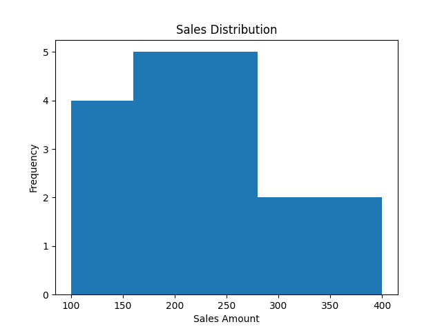

# 🚀 Sales Data Analysis Project (EDA)

<p align="center">
  
  
  
  
</p>

<p align="center">
  <b>Transforming Raw Data into Actionable Business Insights</b><br>
  <i>Exploratory Data Analysis | Data Cleaning | Visualization | Business Thinking</i>
</p>

---

## 📌 Project Overview
This project showcases a full **Exploratory Data Analysis (EDA)** workflow on a real-world sales dataset.

🔍 The focus is not just analysis — but **turning data into business decisions**.

---

## 🎯 Key Highlights
- Cleaned messy, real-world data (missing values, duplicates, outliers)
- Built meaningful visualizations to uncover patterns
- Engineered new features for deeper insights
- Translated data findings into **business strategies**

---

## 📊 Key Insights

### 💡 Sales Distribution
- Most transactions fall within **150–300 range**
- Indicates strong mid-range pricing preference

### 💡 Customer Behavior
- Highest revenue occurs when customers buy **3 items**
- Suggests opportunity for bundle strategies

### 💡 Product Strategy
- **Books category** has highest revenue per unit
- Ideal for marketing focus & expansion

---

## 📈 Example Visualization (Add your screenshot here)

```md

```

---

## 🛠 Tech Stack
- Python
- Pandas
- Matplotlib
- Seaborn
- Jupyter Notebook

---

## ⚙️ Workflow

1. Data Loading & Inspection  
2. Data Cleaning  
3. Outlier Detection (IQR)  
4. Data Visualization  
5. Feature Engineering  
6. Business Insight Extraction  

---

## 📂 Project Structure
```
EDA_Project/
├── data/
├── notebooks/
├── assets/        # charts/screenshots
├── README.md
```

---

## 💼 What This Project Demonstrates
- Ability to handle **real-world messy datasets**
- Strong understanding of **EDA techniques**
- Capability to connect data → **business decisions**
- Clear communication of insights

---

## 🚀 How to Run
```bash
python -m venv .venv
source .venv/bin/activate
pip install pandas matplotlib seaborn
jupyter notebook
```

---

## ⭐ Why This Stands Out
Unlike basic projects, this one:
- Focuses on **decision-making**, not just coding
- Shows **business awareness**
- Is structured like a **real industry project**

---

## 👤 Author
**MAO, RR**  
📅 2026

---

## 🔥 Recruiter Note
This project reflects practical data analysis skills including cleaning, visualization, and insight generation — aligned with real-world business scenarios.
