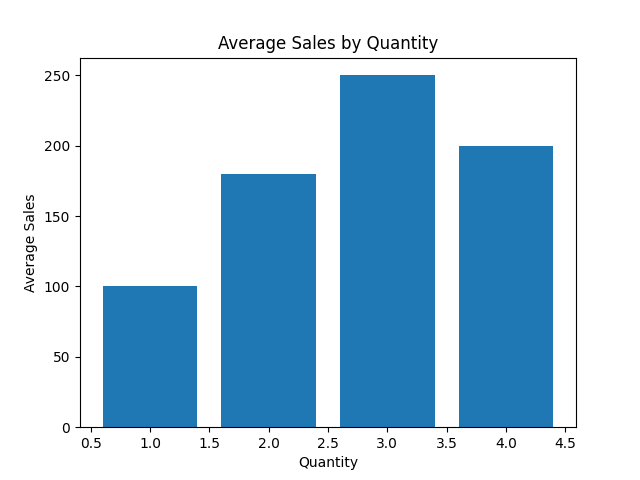

# 🚀 Sales Data Analysis Project (EDA)

<p align="center">
  
  
  
  
</p>

<p align="center">
<b>Transforming Raw Data into Actionable Business Insights</b><br>
<i>Exploratory Data Analysis | Data Cleaning | Visualization | Business Thinking</i>
</p>

---

## 📌 Project Overview
This project demonstrates an end-to-end **Exploratory Data Analysis (EDA)** workflow on sales data, focusing on turning raw data into **business decisions**.

---

## 🔗 Project Links
- 📊 Notebook: [View Analysis](./EDA_Assessment_Activity.ipynb)
- 📁 Dataset: [sales_data.csv](./sales_data.csv)

---

## 🎯 Key Highlights
- Cleaned messy real-world data (missing values, duplicates, outliers)
- Built visualizations to uncover patterns
- Engineered features for deeper insights
- Translated findings into business strategies

---

## 📊 Key Insights

### 💡 Pricing Strategy Insight
- Majority of transactions occur within the **150–300 range**  
- 👉 Recommendation: Focus pricing and promotions in this range to maximize revenue  

### 💡 Customer Behavior Insight
- Customers purchasing **3 items generate the highest revenue**  
- 👉 Recommendation: Use bundle offers to increase average order value  

### 💡 Product Strategy Insight
- **Books category** has highest revenue per unit  
- 👉 Recommendation: Prioritize this category for marketing and expansion  

---

## 📈 Visual Insights

### Sales Distribution


### Average Sales by Quantity


---

## 🛠 Tech Stack
- Python
- Pandas
- Matplotlib
- Seaborn
- Jupyter Notebook

---

## ⚙️ Workflow
1. Data Loading & Inspection  
2. Data Cleaning  
3. Outlier Detection (IQR)  
4. Data Visualization  
5. Feature Engineering  
6. Business Insight Extraction  

---

## 📂 Project Structure
```
.
├── EDA_Assessment_Activity.ipynb
├── sales_data.csv
├── assets/
│   ├── sales_histogram.png
│   └── sales_bar.png
└── README.md
```

---

## 💼 What This Project Demonstrates
- Ability to handle messy datasets  
- Strong EDA and visualization skills  
- Translating data → business decisions  

---

## 📊 Final Takeaway
This project shows how raw sales data can be transformed into actionable strategies such as pricing optimization, customer behavior insights, and product focus decisions.

---

## 👤 Author
**MAO, RR**  
📅 2026
